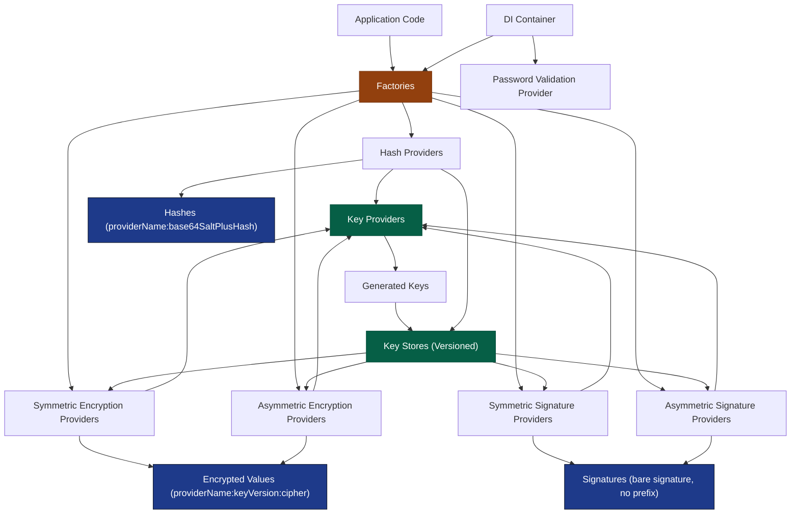

# Corely.Security Documentation

## Overview
Corely.Security gives you small plug-in style building blocks for application "lock and key" needs. You ask a factory for a provider (hashing, encryption, signatures). That provider uses a key (from a key provider) fetched through a versioned key store so you can rotate keys later. The provider returns a self-describing string (it starts with a human-readable provider name, sometimes also a key version) so the library can figure out how to verify or decrypt it later without you tracking metadata. You can plug in custom providers or real key management backends, and everything wires cleanly through dependency injection.

### Concept Map


These blocks provide small, composable building blocks for application-level cryptography & credential workflows:
- Uniform provider interfaces for hashing, encryption, and digital signatures
- URL-safe secret generation for token and verifier workflows
- Pluggable factories keyed by human-readable provider names (enables encoded self-describing values)
- Versioned key stores to support seamless key rotation + on-demand re-encryption
- Minimal DI-friendly construction (no static globals)
- Clear value formats so decryption / verification can auto-select the correct provider

Each topic below maps to a runnable demo in `Corely.Security.DemoApp/Program.cs`.

## Topics
- [Hashing](hashing.md)
- [Symmetric Encryption](symmetric-encryption.md)
- [Asymmetric Encryption](asymmetric-encryption.md)
- [Symmetric Signatures](symmetric-signatures.md)
- [Asymmetric Signatures](asymmetric-signatures.md)
- [Key Providers](key-providers.md)
- [Secret Providers](secret-providers.md)
- [Key Stores](key-stores.md)
- [Provider Factories & Custom Providers](provider-factories.md)
- [Dependency Injection](dependency-injection.md)
- [Password Validation](password-validation.md)

## Value Encoding Formats
Hashes and encrypted values are prefixed with a human-readable provider name (and, for
encryption, a key version) so factories can auto-resolve providers. Signatures are not: they are
verified against a provider and key store the caller already chose.

| Feature | Format |
|---------|--------|
| Hash | `providerName:base64SaltPlusHash` |
| Symmetric Encryption | `providerName:keyVersion:cipherBase64` |
| Asymmetric Encryption | `providerName:keyVersion:cipherBase64` |
| Symmetric Signature | `signatureBase64` (no prefix) |
| Asymmetric Signature | `signatureBase64` (no prefix) |

## Quick Start
```csharp
var hashFactory = new HashProviderFactory(HashConstants.SALTED_SHA256_CODE);
var hash = hashFactory.GetDefaultProvider().Hash("secret");
var valid = hashFactory.GetProviderToVerify(hash).Verify("secret", hash);
```
See individual topic files for more examples. All end-to-end flows are shown in the DemoApp.
